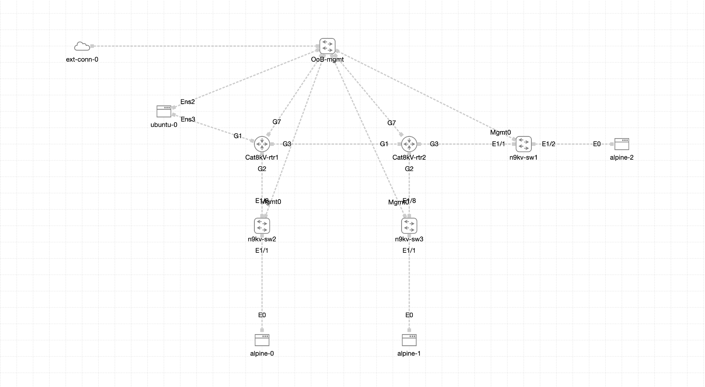

# Automation Day - Practice Files

This repository contains practice labs for the Automation Day event hands-on experience.  The sample diagram for the lab can be found below for reference.



The content is broken up into the following sections:

1. **Section_1-Prepare_CML_Lab_Config**
  * Section 1 is where the Ansible inventory and the lab file for Cisco Modeling Labs are generated.  Contained within the directory is an inventory directory with a lab_values.yaml file.  The IP addressing in this file is designed allow you to start a lab at day 1 (management access only).  The lab contains a Ubuntu (Linux) host that you can access via SSH or using Remote-SSH extension in Visual Studio code.  The Ubuntu host can be used to SSH into CML and perform ping tests and ssh to the Alpine hosts connected to the lab.
  
2. **Section_2-Simple_API_Demo**
  * Section 2 contains preconfigured application programming interface (API) calls and environment variables that can be imported to Postman.  These files will allow exploration of the CML API including authentication steps, uploading a lab file, starting a lab, and verifying operation.

3. **Section_3-Ansible_Labs**
  * Section 3 is broken up into six labs.  Each lab builds upon the next to create a fully operational network.  The final lab validates that all functionality has been integrated into the CML lab.

Each section contains a dedicated ReadMe that further explains how the content in that section/lab works.

## Cisco Modeling Labs Sandbox

These labs can be run in the Cisco Modeling labs sandbox.  Browse to: https://developer.cisco.com/docs/modeling-labs/#!sandbox to reserve a Sandbox.

## Recommedations

The labs in this environment recommends the following items:

* Visual Studio Code (not Visual Studio)
* Visual Studio Code - Extensions (See Installation Instruction below)
   * (Windows Only) Windows Subsystem for Linux - WSL (from Microsoft)
   * Remote - SSH (from Microsoft)
   * YAML (from Red Hat) 
   * Jinja (Authored by: wholroyd)
* Cisco Modeling Labs Sandbox or On-Prem server

Visual Studio Code with WSL or Remote-SSH gives you the capability to access the repository content on a Linux host running in CML or on your local system.  This eliminates the requirement to have a dedicated Linux or Mac host to run the labs contained within.  Instructions for VScode installing extensions can be found below.

It is recommended that you do not change any of the IP addressing within the lab environment except those addresses that are explicitly called out in Section_1-Prepare_CML_Lab_Config.  If you wish to change any of the internal IP addressing, the Ubuntu host needs additional routes added to allow it to communicate with the alternate IP addresses.  If you are comfortable editing the Jinja template for the lab, you may alter the routing configuration before deployment.  ENS4 is the router facing network device in the lab.

## Enable Windows Subsystem for Linux, Configure Ubuntu container

If you have a Windows 10 or newer system you can enable the Windows Subsystem for Linux.  To install:

* Open Start Menu
* Search for Control Panel
* Open Programs and Features
* Select Turn Windows Features on or off from the left side of the panel
* Scroll to Windows Subsystem for Linux, check the box, and hit ok.
  * Once installed you will need to reboot.

When your system completes the installation you can install a Ubuntu 22.04.02 LTS container.  

* Open the start menu, search for Microsoft Store.
* In the Microsoft store, search for Ubuntu and locate the 22.04.02 LTS App.  
  * Click install from the App page.  
* Once installed follow the configuration guide below to get the system prepared for the labs:

Post WSL / Ubuntu Container install

* Launch container
  * Set username and password.  The password is required to run sudo commands, make it something you can remember or the same as your windows login.
* Once container is started run the following commands:

```
sudo apt-get update -y
sudo apt install python3.10 python3-pip git python3-venv sshpass -y
pip3 install --upgrade pip
pip3 install ansible ansible-pylibssh
git clone https://github.com/CiscoSE/AutomationDay_Sandbox_Lab.git
```
Once complete the container will be ready to use for the labs.

# Linux host configuration

If you have a Linux host or VM, you need to run through the process for installing python, git, and ansible.  For Ubuntu 22.04 the instructions are below, instructions for Fedora/CentOS/Red Hat coming soon:

```
sudo apt-get update -y
sudo apt install python3.10 python3-pip git python3-venv sshpass -y
pip3 install --upgrade pip
pip3 install ansible ansible-pylibssh
git clone https://github.com/CiscoSE/AutomationDay_Sandbox_Lab.git
```

## Extension Installation Instructions

Extensions for Visual Studio Code (VScode) can be downloaded from the VScode marketplace.  The marketplace is denoted by the below icon:


Click on the extensions market place icon and you will be presented with a search bar to "Search Extensions in Marketplace".  Search each extension listed above and verify the author/publisher.  Installation can be done by clicking the Install button next to the listed extension or selecting the extension and clicking install from the new window.  You can see both options for doing an install of the YAML extension in the image below.


Some extensions may require VScode to reload.  Complete all extension installs before reloading the application.

# Remote-SSH or WSL in VScode

VScode allows us to connect to a container, WSL instance, or Remote-SSH host.  After installing the extensions you will find a blue icon to launching a remote host.  If you click on it, a menu will open in the upper middle screen allowing you to choose a WSL distro or Remote-SSH host.  If you are using WSL, select Connect to WSL using Distro.  Next select the Ubuntu container we installed.  

If you have a Linux host or VM running in your environment, you can use Remote-SSH.  Select Connect to Host, enter your user@host detail to ssh to your remote host.  If prompted, select your Linux distribution, then enter your password.

With either method, VScode will load some extensions on the system allowing you the ability to open a remote folder.  Before doing this, clone this repo to your remote host by running

```git clone https://github.com/CiscoSE/AutomationDay_Sandbox_Lab.git```

Once complete, click on the explorer button (The two files in the upper left hand corner...if not already open) and then select Open Folder.  Select the AutomationDay_Sandbox_Lab folder and hit OK.  Right Click on Section_1-Prepare_CML_lab_config folder and select Open in Integrated Terminal.

## Outcomes

Customers attending this event will learn how to leverage Ansible, and Postman to configure their lab environments.  The network environment will be provisioned entirely through the use of Ansible's built in modules.  The Ansible lab will demonstrate:

* How to use Postman to authenticate, view, and start labs
* How to build and work with an Ansible inventory
* Using Ansible's CLI modules to run native CLI commands
* Using Ansible's configuration modules to setup interfaces, NTP, banners, etc
* Understand Ansible playbook structure and considerations for building playbooks.
* Creating playbooks that support both NX-OS and IOS-XE platforms
* Creating playbooks to perform 'show' commands and view the output.

## Credentials

For Cisco Modeling Labs and the CML Sandbox Devbox passwords, please review the documentation on your reservation.

The username and password for all switches and linux hosts in this lab are as follows:

* Username: netops
* Password: netops_admin